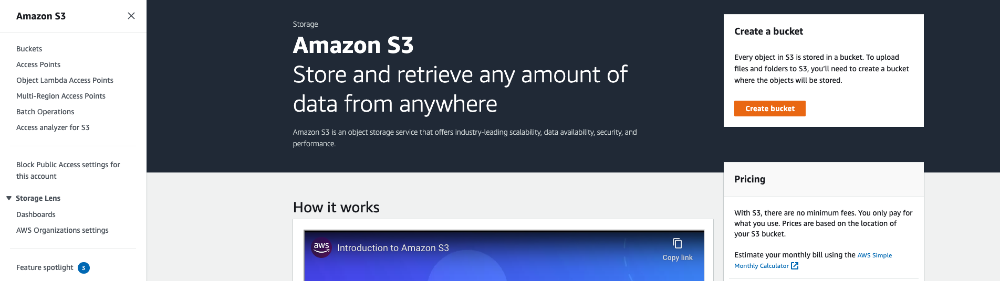
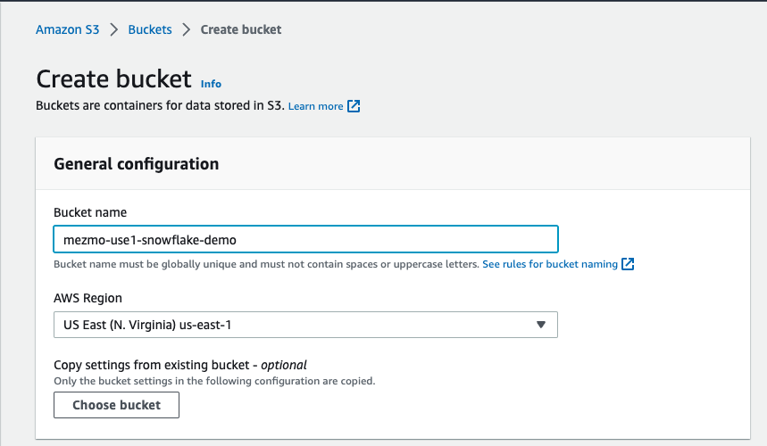
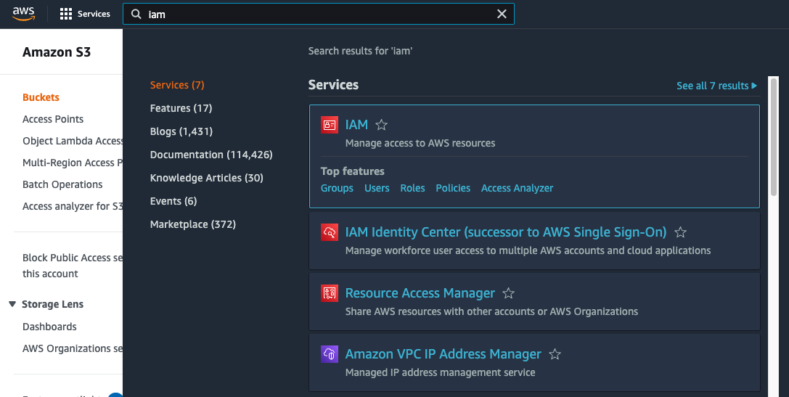
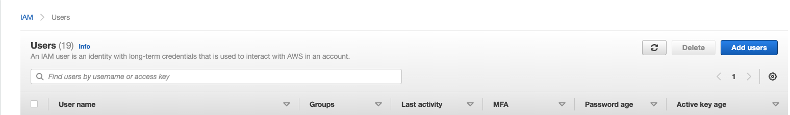
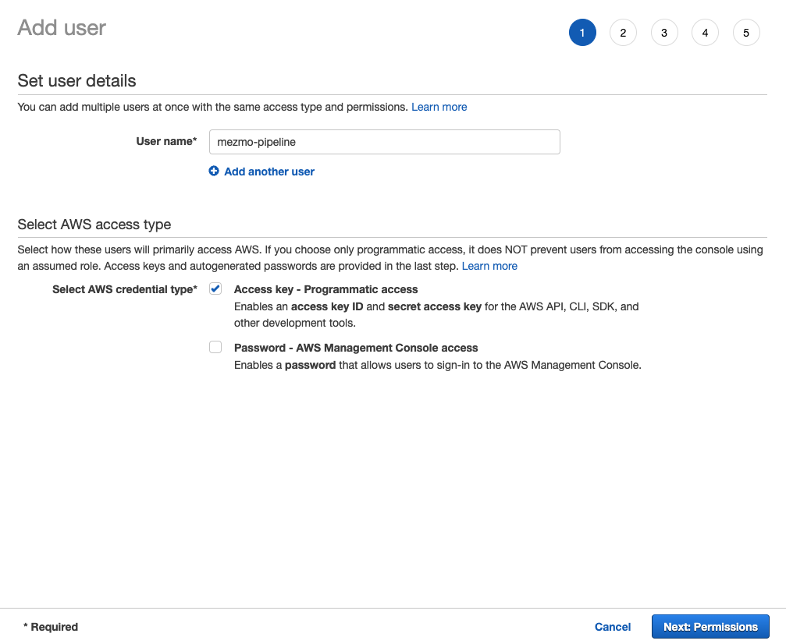
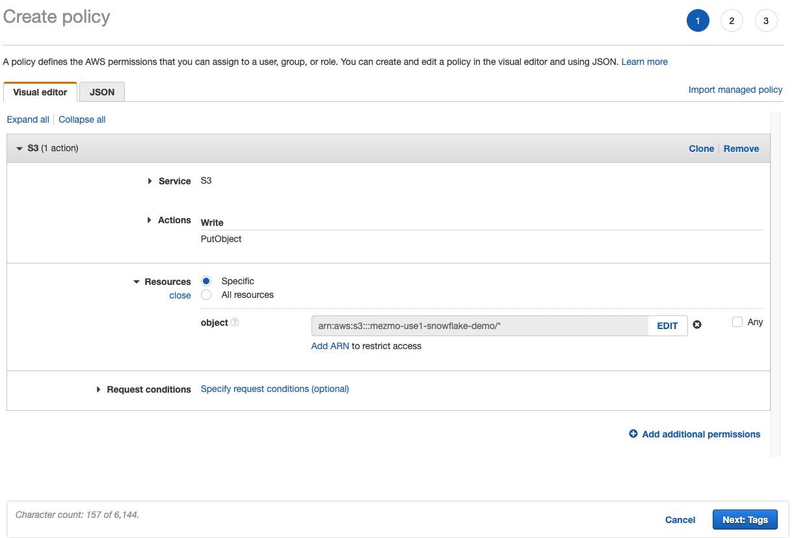
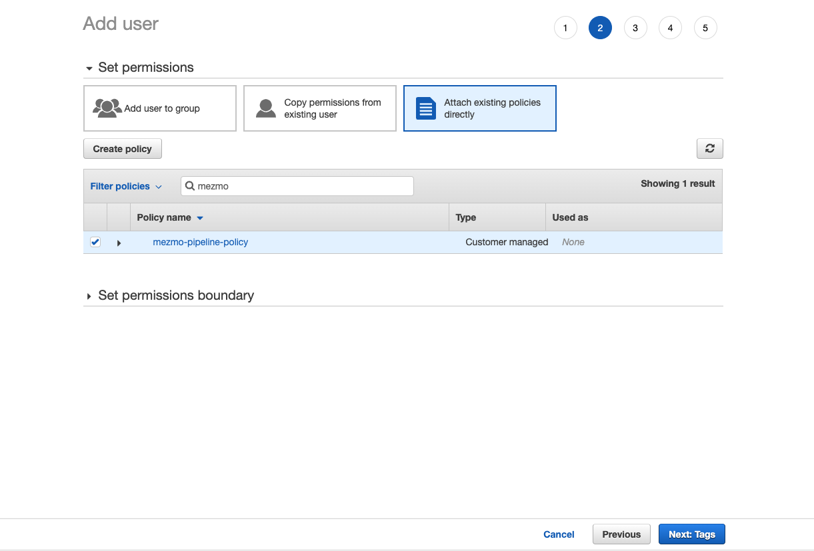
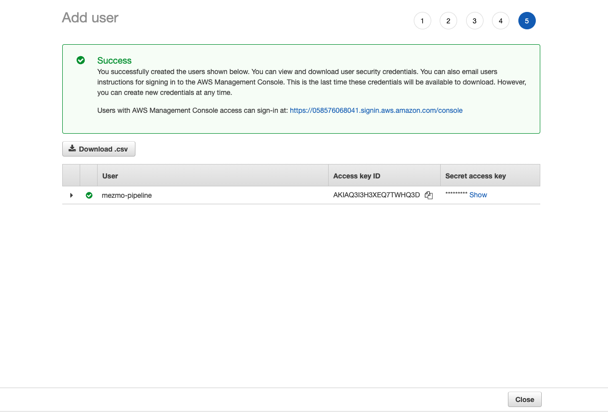
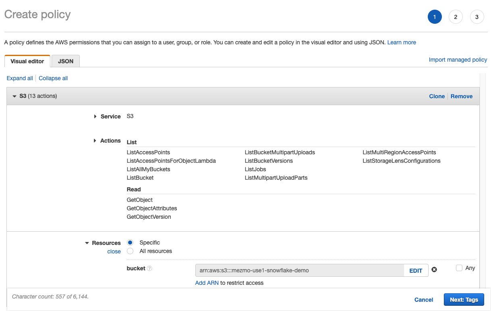

{}

In order to complete this workshop, you will need a AWS account with the ability to create an S3 Bucket and provision a new user Snowflake user.

{}

## Step 1: Create a new S3 Bucket

Once you have logged into your AWS account.  Navigate to S3 service and click the Create bucket button.

Give your bucket a name in the Bucket name field.  Remember bucket names are globally unique, so make it meaningful for your organization.  

Select the region where the bucket will reside.  For best results, utilize the same region Snowflake (on AWS) is currently utilizing.  This will reduce network transfer costs.

You can take the default settings for the rest of the options.  Click Create bucket button.

## Step 2: Create AWS Mezmo Pipeline User

Navigate to the IAM service.

Navigate to the Users section.  Click the Add users button.

Here we are going to create a new user so that pipeline can write data to S3.  Make sure to select the "Access Key - Programmatic Access" as you will need this when setting up the S3 destination in pipeline. 

Next you will want to create a new policy to attach to the user.  This policy needs access to S3 Service, with the ability to PutObject.  In the resources section, add the ARN of the S3 bucket created above.  We want to give pipeline the minimal access required to access your AWS account.

Next we want to attach the policy to the new user.  You may need to click the refresh button on the policy list for newly created policy to show up.

Continue through the process to create the user.  The last screen will contain an Access Key ID and a Secret Access Key.  Copy these keys as you will need later on when building pipeline.

## Step 3: Create AWS Snowflake User

Repeat the above steps but this time we are creating a user so that Snowflake can read the data.

The attached policy will need access to List the files in S3 as well are read access.

Remember to copy the Access Keys as we will need them later on when setting up the Snowflake integration.
