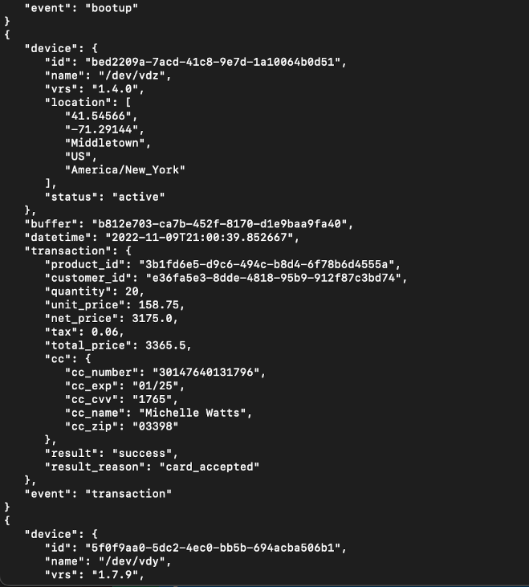
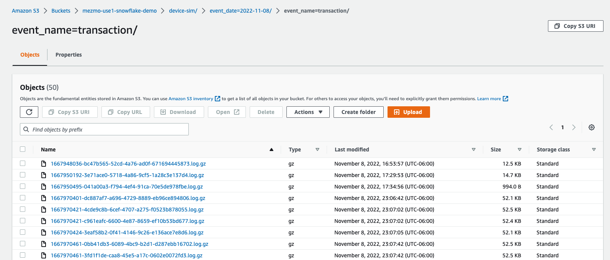

## Run the Simulation

### Get the Docker
First you will need the Docker to simulate.  You can either use our provided docker [NOT_UPLOADED_YET](#) or clone the [GitHub repo](https://github.com/answerbook/financialTransactionDeviceSim).  If using the repo, follow the instructions in [README.md](https://github.com/answerbook/financialTransactionDeviceSim/README.md)to build with one command.

### Configure the Simulation
Next you need to configure the devices via environment variables.  All you need is your Mezmo Pipeline Source Key (`KEY`) and the number of devices to run (`NUMBER_DEVICES`).  We will snag the key in [the next step](/content/en/transaction-to-s3/docs/sources.md) but for now you can just use something made up like `NADA`.  To do this on MacOS, simply run:

```cmd
export KEY=NADA
export NUMBER_DEVICES=25
```

### Run it
You should see the following output.



#### From Docker Hub
```cmd
docker run -e KEY=${KEY} -e NUMBER_DEVICES=${NUMBER_DEVICES} -it mezmo/transaction-device-sim:0.1.0
```

#### Local after Building (see [GitHub repo](https://github.com/logdna/financialTransactionDeviceSim#build-the-docker-image) for steps)
```cmd
docker run -e KEY=${KEY} -e NUMBER_DEVICES=${NUMBER_DEVICES} -it transaction-device-sim
```

## Verify data is flowing into S3

Now let's verify data is flowing to S3.  It may take a few minutes for new data to show up as data is `buffered` in the pipeline for a few seconds before writing to S3.

